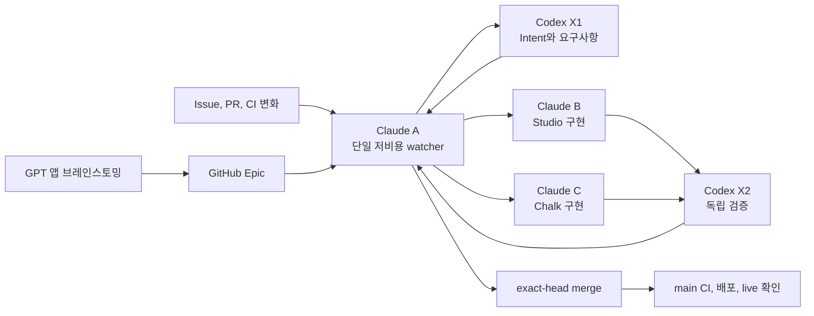

# HypeProof 5세션 전달 운영

> 상태: 활성
> 관련 작업: [Control plane Epic #166](https://github.com/jayleekr/hypeproof-harness/issues/166), [공용 스킬 배포 #169](https://github.com/jayleekr/hypeproof-harness/issues/169)

## Exec Summary



5개 세션이 모두 GitHub를 반복 조회하지 않는다. Claude A 하나가 가장 저렴한 지원 모델과 낮은 reasoning으로 변화만 확인하고, 실제 변화가 있을 때 필요한 역할 하나를 깨운다. 각 역할은 현재 패킷을 끝낸 뒤 idle로 돌아간다.

## Intent

사람이 이미 열어 둔 5개 세션을 이용해 HypeProof의 승인된 요구사항을 계속 전달한다. 탐지, 분배, 구현, 검증, 머지가 대화창 상태에 의존하지 않고 GitHub 기록과 정확한 revision을 기준으로 이어져야 한다.

## 요구사항

- **HAR-DEL-01 공용 계약**: Claude A/B/C와 Codex X1/X2는 Harness에 버전 관리된 하나의 공통 계약을 읽는다. 개인 홈 디렉터리의 파일은 정본이 아니다.
- **HAR-DEL-02 단일 watcher**: Claude A만 Issue, Epic, PR, CI 변화를 감시한다. unchanged tick은 추가 모델 호출과 저장소 읽기를 만들지 않는다.
- **HAR-DEL-03 결정적 분배**: Intent와 요구사항은 X1, Studio 구현은 B, Chalk 구현은 C, 독립 검증은 X2, 통합은 A에 배정한다.
- **HAR-DEL-04 전달 상태**: 입력창에 문자가 보이는 상태, Enter로 제출된 상태, 역할이 ACK한 상태, 실제 작업 중인 상태를 구분한다. 입력창에 남은 패킷은 delivered 또는 accepted가 아니다.
- **HAR-DEL-05 검증된 제출**: cmux adapter는 전체 프롬프트 전송이 끝난 뒤 같은 surface에 Enter 키를 보내고 실제 `Working` 상태를 확인한다. 입력창에 남아 있으면 실패이며, 바쁜 세션이나 비어 있지 않은 입력창에는 두 번째 패킷을 넣지 않는다.
- **HAR-DEL-06 비용 경계**: 구현과 검증 모델은 변화가 있을 때만 사용한다. 일상 X2 검증은 GPT-5.6 Sol high를 사용하고, 논쟁적이거나 위험도가 높은 판정만 GPT-6 Astra high로 올릴 수 있다.
- **HAR-DEL-07 통합 완료**: 필수 check, 해당 evidence, dependency order가 충족된 exact head는 리뷰 요청을 기다리지 않고 A가 squash-merge한다. 이후 merge SHA, main CI, 배포와 주장한 live surface를 확인한다.
- **HAR-DEL-08 실패 보존**: capacity, permission, usage, context, missing runner와 기술적 승인 gate를 서로 다른 상태로 남긴다. 전달되지 않은 패킷 token은 ACK하지 않는다.

## 역할과 호출

| 역할 | 스킬 | 책임 |
|---|---|---|
| Claude A | `hype-coordinate` | 변화 탐지, 분배, ACK 추적, 통합 |
| Codex X1 | `hype-intent` | GPT Epic과 Intent를 요구사항 및 테스트 조건으로 연결 |
| Claude B | `hype-studio` | Studio 구현과 자체 테스트 |
| Claude C | `hype-chalk` | Chalk 및 authoring 구현과 자체 테스트 |
| Codex X2 | `hype-verify` | exact head와 실제 UI 또는 host 동작의 독립 검증 |

작업과 GitHub 인계는 영어로 쓰고, 사용자 보고는 한국어로 한다.

## 전달 상태

```text
discovered -> proposed -> submitted -> accepted -> active
           -> waiting                         -> in_review -> verified -> integrated
```

- **proposed**: GitHub에 역할이 기록됐지만 세션에는 아직 입력되지 않았다.
- **submitted**: 입력이 Enter로 제출됐지만 역할의 ACK는 아직 없다.
- **accepted**: 실제 세션과 branch identity가 GitHub 기록에 ACK됐다.
- **active**: 해당 branch 또는 worktree에서 작업이 시작됐다.
- **waiting**: capacity, busy prompt, dependency, permission 같은 정확한 gate가 기록됐다.
- **integrated**: exact head가 머지되고 main 및 필요한 배포 증거가 확인됐다.

## 배포와 설치

정본은 Harness의 `skills/`이다. `scripts/register-skills.sh`가 Harness 내부 Claude 검색 링크를 만들고, `scripts/sync.sh`가 3개 consumer 저장소의 `.claude/skills/`로 역할 스킬과 운영 스킬을 복사한다. Codex 개인 설치도 Harness 정본을 복사하거나 링크해야 한다.

공통 계약은 `skills/hype-coordinate/references/team-contract.md` 한 파일이다. 다른 네 역할은 상대 경로로 이 파일을 읽어 중복 계약이 갈라지지 않게 한다.

## 검증 경계

정적 검사와 dispatcher 단위 테스트는 스킬 등록, 계약 연결, cmux 명령 형식을 입증한다. 실제 ACK와 제품 구현 완료는 대상 세션, GitHub revision, CI, 실제 UI 또는 host 증거로 별도 확인한다.
