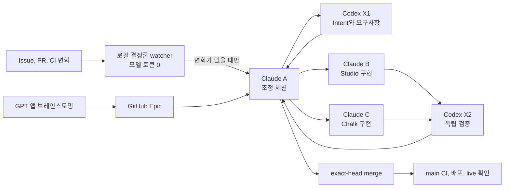

# HypeProof 5세션 전달 운영

> 상태: 활성
> 관련 작업: [Control plane Epic #166](https://github.com/jayleekr/hypeproof-harness/issues/166), [공용 스킬 배포 #169](https://github.com/jayleekr/hypeproof-harness/issues/169)

## Exec Summary



5개 세션이 모두 GitHub를 반복 조회하지 않는다. Claude A cmux 세션의 자식 프로세스로 도는 Python watcher가 delta 도구만 실행하고, 실제 변화가 있을 때만 Claude A를 깨운다. unchanged 확인은 모델 토큰을 쓰지 않는다. A는 필요한 역할 하나를 깨우고 현재 조정을 끝낸 뒤 idle로 돌아간다.

## Intent

사람이 이미 열어 둔 5개 세션을 이용해 HypeProof의 승인된 요구사항을 계속 전달한다. 탐지, 분배, 구현, 검증, 머지가 대화창 상태에 의존하지 않고 GitHub 기록과 정확한 revision을 기준으로 이어져야 한다.

## 요구사항

- **HAR-DEL-01 공용 계약**: Claude A/B/C와 Codex X1/X2는 Harness에 버전 관리된 하나의 공통 계약을 읽는다. 개인 홈 디렉터리의 파일은 정본이 아니다.
- **HAR-DEL-02 단일 watcher**: 로컬 결정론 watcher 하나만 Issue, Epic, PR, CI 변화를 감시한다. unchanged tick은 모델 세션을 호출하지 않는다. 변화가 있을 때만 A가 조정한다.
- **HAR-DEL-03 결정적 분배**: Intent와 요구사항은 X1, Studio 구현은 B, Chalk 구현은 C, 독립 검증은 X2, 통합은 A에 배정한다.
- **HAR-DEL-04 전달 상태**: 입력창에 문자가 보이는 상태, Enter로 제출된 상태, 역할이 ACK한 상태, 실제 작업 중인 상태를 구분한다. 입력창에 남은 패킷은 delivered 또는 accepted가 아니다.
- **HAR-DEL-05 검증된 제출**: cmux adapter는 전체 프롬프트 전송이 끝난 뒤 같은 surface에 Enter 키를 보내고 실제 `Working` 상태를 확인한다. 입력창에 남아 있으면 실패이며, 바쁜 세션이나 비어 있지 않은 입력창에는 두 번째 패킷을 넣지 않는다. 입력창에 글자가 보이면 탐침 한 글자(`¶`)를 입력해 구분한다. 제안 문구는 탐침으로 대체되고 실제 입력은 뒤에 탐침이 붙는다. 어느 쪽이든 backspace 한 번으로 되돌리며, 실제 입력이면 발송하지 않고 제안 문구를 제출하거나 실제 입력을 지우지 않는다.
- **HAR-DEL-06 비용 경계**: 구현과 검증 모델은 변화가 있을 때만 사용한다. 일상 X2 검증은 GPT-5.6 Sol high를 사용하고, 논쟁적이거나 위험도가 높은 판정만 GPT-6 Astra high로 올릴 수 있다.
- **HAR-DEL-07 통합 완료**: 필수 check, 해당 evidence, dependency order가 충족된 exact head는 리뷰 요청을 기다리지 않고 A가 squash-merge한다. 이후 merge SHA, main CI, 배포와 주장한 live surface를 확인한다.
- **HAR-DEL-08 실패 보존**: capacity, permission, usage, context, missing runner와 기술적 승인 gate를 서로 다른 상태로 남긴다. 전달되지 않은 패킷 token은 ACK하지 않는다.
- **HAR-DEL-09 지속 실행**: watcher는 이미 열린 `claude-1` 세션의 살아 있는 자식 프로세스로 실행하고 겹치는 tick과 두 번째 loop를 잠근다. cmux `cmuxOnly` 소켓은 LaunchAgent와 launchd에 입양된 분리 daemon을 거부하므로(#180) 둘 다 쓰지 않는다. 거부되면 재시도하지 않고 멈춰 A가 알게 한다. 세션을 생성하거나 로그인하지 않는다. A가 busy이거나 입력창이 비어 있지 않으면 pending token을 보존하고 다음 tick에서 다시 시도한다.

## 역할과 호출

| 역할 | 스킬 | 책임 |
|---|---|---|
| Claude A | `hype-coordinate` | 변화 탐지, 분배, ACK 추적, 통합 |
| Codex X1 | `hype-intent` | GPT Epic과 Intent를 요구사항 및 테스트 조건으로 연결 |
| Claude B | `hype-studio` | Studio 구현과 자체 테스트 |
| Claude C | `hype-chalk` | Chalk 및 authoring 구현과 자체 테스트 |
| Codex X2 | `hype-verify` | exact head와 실제 UI 또는 host 동작의 독립 검증 |

작업과 GitHub 인계는 영어로 쓰고, 사용자 보고는 한국어로 한다.

### 지속 watcher 실행

Claude A 세션에서 background shell task 하나로 시작한다. 세션이 살아 있는 동안 cmux의 자식으로 남는다.

```bash
python3 skills/hype-coordinate/scripts/watch_delivery.py \
  --state-file "$HOME/Library/Application Support/HypeProof/delivery-delta.json" --apply --loop
```

loop는 즉시 한 번, 이후 5분마다 tick을 실행하고 tick마다 JSON 한 줄을 출력한다. watcher는 `watch_delivery.py`와 `delivery_delta.py`만 실행하므로 unchanged 상태에서는 AI 모델 호출이 없다. pending work가 있을 때 `wake_role.py --role a`가 이미 열린 `claude-1`에 한 패킷만 제출한다. A 세션 안에는 `/loop`나 `CronCreate`를 등록하지 않는다.

- 두 번째 loop는 `already_running`으로 즉시 끝난다. 실행 중인 loop의 pid는 `delivery-delta.json.loop.lock`에 있다.
- `nohup`, `setsid`, `&`로 분리하지 않는다. 부모가 끝나 launchd에 입양되면 cmux가 연결을 끊는다(`Broken pipe, errno 32`). loop는 입양 상태에서 시작을 거부한다.
- 소켓이 거부되면(`socket_access_denied`) exit 3으로 멈춘다. A는 background task 종료로 이를 안다.
- 중지는 background task를 멈추거나 lock 파일의 pid에 SIGTERM을 보낸다.

PR 상태 수집은 저장소마다 `gh pr list` 한 번으로 필요한 필드를 함께 읽는다. open PR 수만큼 `gh pr view`를 반복하지 않는다.

## 전달 상태

```text
discovered -> proposed -> submitted -> accepted -> active
           -> waiting                         -> in_review -> verified -> integrated
```

- **proposed**: GitHub에 역할이 기록됐지만 세션에는 아직 입력되지 않았다.
- **submitted**: helper 상태 `submitted_pending_ack`. 고유 시도 marker 뒤의 새 실행을
  관찰했지만 역할의 GitHub ACK는 아직 없다. 터미널 관찰만으로 accepted/active가 되지 않는다.
- **accepted**: 실제 세션과 branch identity가 GitHub 기록에 ACK됐다.
- **active**: 해당 branch 또는 worktree에서 작업이 시작됐다.
- **waiting**: capacity, busy prompt, dependency, permission 같은 정확한 gate가 기록됐다.
- **integrated**: exact head가 머지되고 main 및 필요한 배포 증거가 확인됐다.

## 배포와 설치

정본은 Harness의 `skills/`이다. `scripts/register-skills.sh`가 Harness 내부 Claude 검색 링크를 만들고, `scripts/sync.sh`가 3개 consumer 저장소의 `.claude/skills/`로 역할 스킬과 운영 스킬을 복사한다. Codex 개인 설치도 Harness 정본을 복사하거나 링크해야 한다.

공통 계약은 `skills/hype-coordinate/references/team-contract.md` 한 파일이다. 다른 네 역할은 상대 경로로 이 파일을 읽어 중복 계약이 갈라지지 않게 한다.

## 검증 경계

정적 검사와 dispatcher 단위 테스트는 스킬 등록, 계약 연결, cmux 명령 형식을 입증한다. 실제 ACK와 제품 구현 완료는 대상 세션, GitHub revision, CI, 실제 UI 또는 host 증거로 별도 확인한다.
